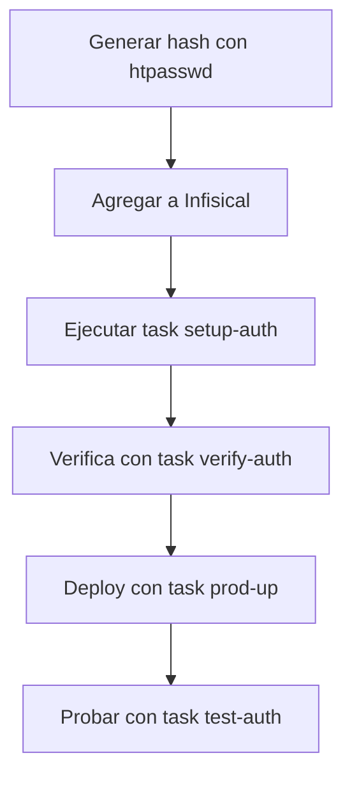
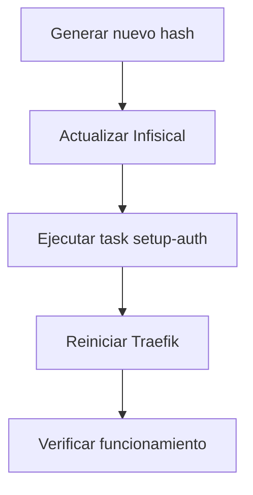

#  Proteccion de Endpoints en Produccion con Basic Auth

##  Resumen Ejecutivo

He implementado **autenticacion basica HTTP (Basic Auth)** para proteger endpoints sensibles en produccion, manteniendo la API publica accesible.

---

## OK Soluciones Implementadas

### **Solucion Principal: Basic Auth con Traefik**

**Ventajas:**
- OK Simple de configurar y mantener
- OK Estandar de la industria
- OK Bien soportado por Traefik
- OK Seguro con bcrypt
- OK Solo en produccion (desarrollo sin restricciones)
- OK Un comando para configurar: `task setup-auth`

**Endpoints Protegidos en Produccion:**
```
 /docs            Swagger UI
 /redoc           ReDoc
 /scalar          Scalar Docs
 /openapi.json    OpenAPI Schema
 /admin/*         Endpoints administrativos
 /roles/*         Gestion de roles
```

**Endpoints Publicos (sin cambios):**
```
 /health          Health check
 /api/v1/*        API principal
 [otros]          Cualquier otro endpoint
```

---

##  Uso Rapido (TL;DR)

```bash
# 1. Genera credenciales
htpasswd -nbB admin tu_password_seguro

# 2. Agrega a Infisical (en el dashboard o CLI)
infisical secrets set TRAEFIK_DASHBOARD_USERS=admin:\$2y\$05\$...
# Nota: En la CLI de Infisical, escapa el $ con \ si usas bash/zsh

# 3. Genera archivo de autenticacion
task setup-auth

# 4. Despliega
task prod-up

# 5. Prueba
curl -u admin:tu_password https://api.serviperfilesayc.com/docs
```

---

##  Archivos Creados/Modificados

###  **Nuevos Scripts**
- `scripts/setup-basic-auth.sh` - Genera `.htpasswd` desde variable de entorno
- Permisos de ejecucion ya configurados

###  **Configuration Actualizada**
- `docker-compose.prod.yml` - Monta `.htpasswd` en Traefik
- `traefik/dynamic_conf.yml` - Middleware `basicAuth` configurado
- `.env.example` - Documentada variable `TRAEFIK_DASHBOARD_USERS`
- `.gitignore` - Excluye `.htpasswd` del versionado
- `Taskfile.yml` - Comandos: `setup-auth`, `test-auth`, `verify-auth`

###  **Documentacion**
- `docs/BASIC_AUTH_SETUP.md` - Guia completa (paso a paso)
- `docs/BASIC_AUTH_IMPLEMENTATION_SUMMARY.md` - Resumen tecnico
- `docs/QUICK_AUTH_SETUP.md` - Guia express (30 segundos)
- `docs/DEPLOYMENT_CHECKLIST.md` - Checklist de despliegue
- `docs/TRAEFIK_SETUP.md` - Actualizado con info de Basic Auth
- `traefik/README.md` - Documentacion del directorio
- `traefik/.htpasswd.example` - Archivo de ejemplo

---

##  Configuration Detallada

### **1. Variable de Entorno (en Infisical)**

```bash
# Seteo via CLI (o usa el Dashboard de Infisical)
infisical secrets set DOMAIN=api.serviperfilesayc.com
infisical secrets set LETSENCRYPT_EMAIL=adhbach23@gmail.com
infisical secrets set TRAEFIK_DASHBOARD_USERS=admin:\$2y\$05\$JULU2FgF3Bxy5OYBSZYvq.oDc/QY0xzu7xRosGMc3qbSISTDK5KyO
```

**Nota:** Al usar Infisical, no necesitas escapar los `$` con `$$` como en los archivos `.env` tradicionales. El script `setup-auth` maneja ambos formatos por compatibilidad. Pero recorda escapar con `\` en tu terminal si usas la CLI.

### **2. Archivo de Authentication**

El script `setup-basic-auth.sh` genera `traefik/.htpasswd` inyectando las variables desde Infisical:

```bash
task setup-auth
```

**Nota:** Los `$$` son para escapar el `$` en archivos `.env`. El script los convierte a `$` simple automaticamente.

### **2. Archivo de Authentication**

El script `setup-basic-auth.sh` genera `traefik/.htpasswd`:

```bash
task setup-auth
```

**Resultado:**
```
admin:$2y$05$JULU2FgF3Bxy5OYBSZYvq.oDc/QY0xzu7xRosGMc3qbSISTDK5KyO
```

### **3. Configuration de Traefik**

En `docker-compose.prod.yml`, Traefik monta el archivo:

```yaml
volumes:
  - ./traefik/.htpasswd:/etc/traefik/.htpasswd:ro
```

En `traefik/dynamic_conf.yml`, el middleware esta configurado:

```yaml
http:
  middlewares:
    basicAuth:
      basicAuth:
        usersFile: /etc/traefik/.htpasswd
        realm: "Restricted Access"
```

### **4. Rutas Protegidas**

En `docker-compose.prod.yml`, las rutas se dividen en 3 routers:

**Router 1: API Publica (sin auth)**
```yaml
- "traefik.http.routers.backend-https.rule=Host(`${DOMAIN}`) && 
    !PathPrefix(`/docs`) && !PathPrefix(`/redoc`) && 
    !PathPrefix(`/scalar`) && !PathPrefix(`/openapi.json`) && 
    !PathPrefix(`/admin`) && !PathPrefix(`/roles`)"
```

**Router 2: Documentacion (con auth)**
```yaml
- "traefik.http.routers.backend-docs.rule=Host(`${DOMAIN}`) && 
    (PathPrefix(`/docs`) || PathPrefix(`/redoc`) || 
     PathPrefix(`/scalar`) || PathPrefix(`/openapi.json`))"
- "traefik.http.routers.backend-docs.middlewares=basicAuth@file"
```

**Router 3: Admin (con auth)**
```yaml
- "traefik.http.routers.backend-admin.rule=Host(`${DOMAIN}`) && 
    (PathPrefix(`/admin`) || PathPrefix(`/roles`))"
- "traefik.http.routers.backend-admin.middlewares=basicAuth@file"
```

---

##  Testing

### **Comandos de Task**

```bash
# Verificar configuration
task verify-auth

# Probar autenticacion (interactivo)
task test-auth

# Ver logs de Traefik
task prod-logs-traefik
```

### **Pruebas Manuales**

```bash
# ERROR Sin auth (debe retornar 401)
curl -i https://api.serviperfilesayc.com/docs

# OK Con auth (debe retornar 200)
curl -u admin:password -i https://api.serviperfilesayc.com/docs

# OK Endpoint publico (sin auth, debe retornar 200)
curl -i https://api.serviperfilesayc.com/health
```

### **Desde el Navegador**

1. Abre: `https://api.serviperfilesayc.com/docs`
2. Veras un popup de autenticacion
3. Ingresa: user `admin`, password `tu_password`
4. OK Acceso concedido

---

##  Seguridad

### **Caracteristicas de Seguridad**
- OK **Bcrypt hash** - Algoritmo de hash seguro (usa flag `-B` en htpasswd)
- OK **Permisos 600** - Solo el propietario puede leer/escribir `.htpasswd`
- OK **Infisical** - Secretos centralizados y encriptados
- OK **No versionado** - `.htpasswd` y secretos estan fuera de Git
- OK **Solo produccion** - Desarrollo sin restricciones
- OK **HTTPS obligatorio** - Traefik redirige HTTP  HTTPS

### **Mejores Practicas**
-  Usa passwords fuertes (16+ caracteres)
-  Cambia credenciales periodicamente
-  Un user por persona (no compartir)
-  Guarda credenciales en un password manager
-  Nunca versiones secretos en Git

---

##  Alternativas Consideradas

| Alternativa | Ventajas | Desventajas | Decision |
|------------|----------|-------------|----------|
| **Basic Auth** | Simple, estandar, seguro con bcrypt | Requiere HTTPS | OK **ELEGIDA** |
| OAuth2/JWT | Muy seguro, tokens | Complejo de implementar | ERROR Overkill |
| IP Whitelisting | Simple | No funciona con IPs dinamicas | ERROR Inflexible |
| Credenciales en codigo | Muy simple | Inseguro, dificil de mantener | ERROR Inseguro |

---

##  Flujo de Work

### **Primera Configuration**



### **Actualizar Credenciales**



---

##  Documentacion

### **Para Desarrolladores**
-  `docs/BASIC_AUTH_SETUP.md` - Guia completa con ejemplos
-  `docs/QUICK_AUTH_SETUP.md` - Setup rapido en 5 pasos
-  `docs/BASIC_AUTH_IMPLEMENTATION_SUMMARY.md` - Detalles tecnicos

### **Para Operaciones**
-  `docs/DEPLOYMENT_CHECKLIST.md` - Checklist paso a paso
-  `docs/TRAEFIK_SETUP.md` - Setup completo de Traefik

### **Para Troubleshooting**
-  Ver seccion "Troubleshooting" en `BASIC_AUTH_SETUP.md`
-  Logs: `task prod-logs-traefik`
-  Verificacion: `task verify-auth`

---

##  Troubleshooting Rapido

| Problema | Solucion |
|----------|----------|
| 401 con credenciales correctas | `task setup-auth && task prod-restart` |
| Variable no definida | Agregar `TRAEFIK_DASHBOARD_USERS` a Infisical |
| Archivo no encontrado | Verificar con `task verify-auth` |
| Los `$` no funcionan | Escapar con `\` en la CLI de Infisical |

---

##  Comandos Utiles

```bash
# Configuration
task setup-auth              # Generar .htpasswd
task verify-auth             # Verificar configuration
task password                # Generar nuevo hash

# Despliegue
task prod-up                 # Iniciar en produccion
task prod-restart            # Reiniciar servicios
task prod-down               # Detener servicios

# Monitoreo
task prod-logs-traefik       # Ver logs de Traefik
task prod-logs-backend       # Ver logs del backend
task prod-ps                 # Ver estado de contenedores

# Testing
task test-auth               # Probar autenticacion
curl -u user:pass URL        # Prueba manual con auth
```

---

##  Conceptos Clave

### **Que es Basic Auth?**
- Estandar HTTP para autenticacion simple
- User y password se envian en cada request
- El navegador los cachea durante la sesion
- **Requiere HTTPS** para ser seguro (ya lo tienes)

### **Por que Bcrypt?**
- Algoritmo de hash resistente a ataques de fuerza bruta
- Computacionalmente costoso (dificulta ataques)
- Usado por: GitHub, GitLab, Bitbucket, etc.
- Generado con flag `-B` en `htpasswd`

### **Por que Infisical?**
- Secretos centralizados y encriptados.
- Facilita el intercambio de secretos entre el equipo de forma segura.
- Inyeccion dinamica en el entorno de ejecucion.
- Permite manejar caracteres especiales (`$`) sin el escape `$$` requerido en `.env`.

---

##  Resultado Final

### **Antes (sin proteccion)**
```
ERROR Cualquiera puede ver /docs
ERROR Cualquiera puede ver /admin
ERROR Informacion sensible expuesta
```

### **Despues (con Basic Auth)**
```
OK /docs requiere autenticacion
OK /admin requiere autenticacion
OK API publica sigue accesible
OK Solo users autorizados acceden a endpoints sensibles
OK Desarrollo sin restricciones (facilita testing)
```

---

##  Soporte

**Documentacion:**
- Ver `docs/BASIC_AUTH_SETUP.md` para guia completa
- Ver `docs/DEPLOYMENT_CHECKLIST.md` para despliegue

**Debugging:**
```bash
task prod-logs-traefik   # Ver logs de Traefik
task verify-auth         # Verificar configuration
cat traefik/.htpasswd    # Ver archivo de auth
```

**Comandos utiles:**
```bash
# Regenerar autenticacion
task setup-auth

# Reiniciar Traefik
docker compose -f docker-compose.prod.yml restart traefik

# Verificar montaje en contenedor
docker exec traefik-prod ls -la /etc/traefik/.htpasswd
```

---

##  Proximos Pasos Recomendados

1. OK **Probar en local** con `docker-compose.test-local.yml`
2. OK **Desplegar en produccion** siguiendo `DEPLOYMENT_CHECKLIST.md`
3. OK **Documentar credenciales** en password manager
4. OK **Compartir acceso** con tu equipo de forma segura
5.  Configurar monitoreo y alertas
6.  Establecer calendario de rotacion de credenciales
7.  Auditoria de seguridad periodica

---

**Dudas?** Consulta la documentacion en `docs/` o revisa los comentarios en los archivos de configuration.
