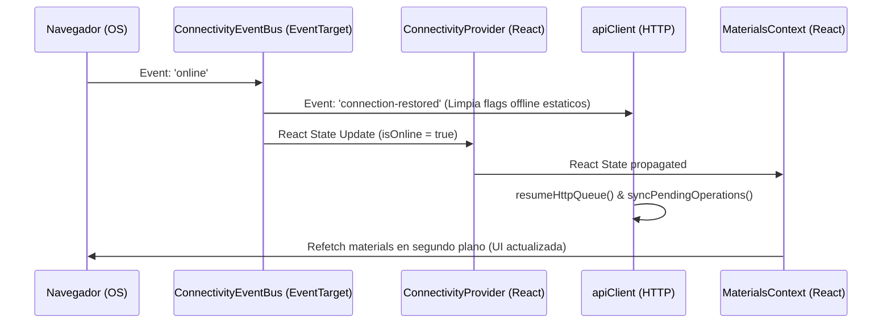

# Design: Offline State Management & Material Sync

Este document define las decisiones de diseno para resolver el almacenamiento offline de datos maestros, la preservacion de payloads inmutables en IndexedDB y el mecanismo reactivo de reconexion para evitar el "bucle offline".

---

## 1. ESTRATEGIA DE CACHE DE DATOS MAESTROS (WORKBOX SW)

Para asegurar la disponibilidad y frescura de los selectores, usaremos la estrategia **Network-First (con fallback en cache)** a traves de Workbox. Esto nos garantiza que si el user tiene red, siempre obtendra la ultima actualizacion de los tipos de materials y composiciones de forma inmediata, y solo si la red falla, se servira el catalogo persistido localmente.

```typescript
// public/sw.ts (Estrategia sugerida en el SW)
import { registerRoute } from 'workbox-routing';
import { NetworkFirst } from 'workbox-strategies';
import { CacheableResponsePlugin } from 'workbox-cacheable-response';
import { ExpirationPlugin } from 'workbox-expiration';

// Cache para datos maestros de materials con estrategia Network-First
registerRoute(
  ({ url }) => url.pathname.includes('/api/material-types') || url.pathname.includes('/api/compositions'),
  new NetworkFirst({
    cacheName: 'master-data-cache',
    plugins: [
      new CacheableResponsePlugin({
        statuses: [0, 200],
      }),
      new ExpirationPlugin({
        maxEntries: 50,
        maxAgeSeconds: 7 * 24 * 60 * 60, // 7 dias
      }),
    ],
  })
);
```

---

## 2. INMUTABILIDAD DEL PAYLOAD EN INDEXEDDB

Para evitar que los payloads se corrompan o pierdan consistencia relacional durante el encolado offline, utilizaremos un flujo de mapeo inmutable en el client antes de persistir en el almacen de IndexedDB `pending_operations`.

```
Formulario (UI) 
   
   
[Sanitize/Map Payload]  Mapeo de URIs locales de imagenes ("local-media://...")
   
   
[Freeze Object]  Asegura inmutabilidad en memoria antes de persistir
   
   
[IndexedDB Store]  Persiste en "pending_operations" con UUID y timestamp
```

### Contract de la Operacion Pending (`pwaSyncContracts.ts`):
```typescript
export interface CreateMaterialPayload {
  name: string;
  sku: string;
  materialTypeId: string;
  compositionId: string;
  unit: string;
  price: number;
  localImageId?: string; // Apunta a localMediaStore (IndexedDB)
}

export interface OfflineOperation {
  id: string; // UUID v4 temporal generado en client
  type: 'CREATE_MATERIAL';
  endpoint: '/api/materials';
  method: 'POST';
  payload: CreateMaterialPayload;
  timestamp: number;
  attempts: number;
}
```

---

## 3. MAQUINA DE ESTADO DE CONECTIVIDAD (EVENT BUS REACTIVO)

El bug critico de desincronizacion de estado ocurre porque el `apiClient` o los contexts almacenan en cache de forma estatica o no-reactiva la variable `isOnline`, o fallan en propagar la recuperacion de red.

Para solucionarlo, desacoplamos la deteccion de red implementando un **Event Target global** que actua como un Event Bus de conectividad de bajo nivel, obligando a todos los servicios HTTP a limpiar sus variables estaticas.



### Implementacion del Event Bus (`src/services/pwa/connectivityBus.ts`):
```typescript
// Bus de eventos nativo de bajo nivel para maxima reactividad
export const connectivityBus = new EventTarget();

export const emitConnectionRestored = () => {
  connectivityBus.dispatchEvent(new Event('connection-restored'));
};
```

### Integracion en `apiClient.ts`:
```typescript
import { connectivityBus } from './pwa/connectivityBus';

class ApiClient {
  private isLocallyOffline = false;

  constructor() {
    connectivityBus.addEventListener('connection-restored', () => {
      // Destrabe absoluto de llamadas HTTP
      this.isLocallyOffline = false;
      this.resumePendingRequests();
    });
  }

  private resumePendingRequests() {
    // Reintenta de inmediato la sincronizacion si hay cola
  }
}
```
---

## 4. ANALISIS DE TRADEOFFS Y RIESGOS

### T1: Stale-While-Revalidate vs Network-First para Datos Maestros
* **Network-First (Elegida)**: 
  * *Pros*: Garantia absoluta de frescura de datos en tiempo real cuando hay conexion. Si el administrador anade nuevos tipos de materials o composiciones, el operario los ve de forma inmediata al abrir el formulario.
  * *Contras*: Si la red del client es extremadamente lenta (pero no esta totalmente offline), la peticion HTTP de lectura puede demorarse antes de saltar el timeout y recurrir al cache, lo cual podria degradar momentaneamente la UX en arranques lentos.
  * *Mitigacion*: Se configurara un timeout optimizado (ej. 3-5 segundos) en el middleware de red de Workbox para que salte rapidamente al cache de IndexedDB/CacheStorage en redes congestionadas.

### T2: EventBus nativo vs React Context para apiClient
* **EventBus nativo (Elegido)**: 
  * *Pros*: El `apiClient` es un servicio puro (clase TypeScript) fuera del arbol de renderizado de React. Un Context de React no puede ser consumido directamente por clases/servicios puros sin acoplarlos innecesariamente a hooks de React. El EventBus nativo soluciona este desacople con elegancia arquitectonica.
