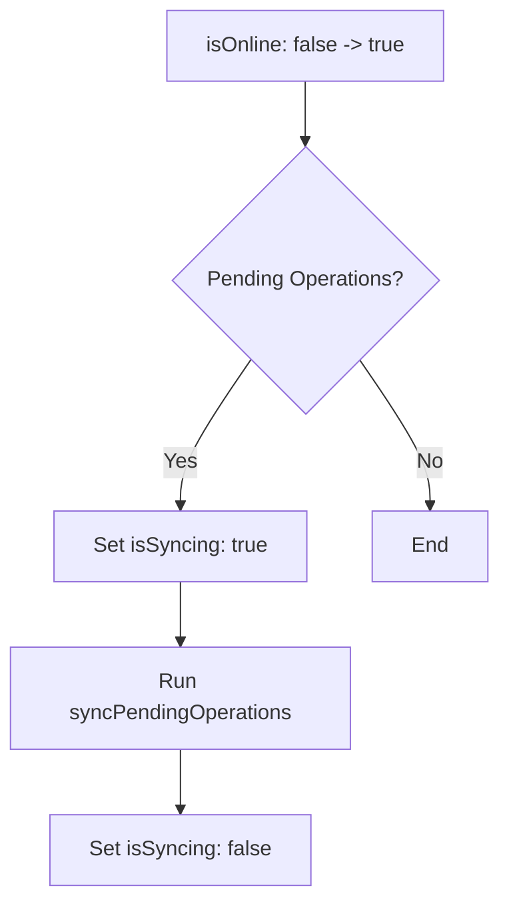

# Design: Service Worker & Sync Stability

## SW Dev Lifecycle

To prevent `localhost` from being hijacked by a stale Service Worker, we will adopt the following strategy:

1. **Vite PWA DevOptions**: Enable `devOptions: { enabled: true, type: 'module' }`.
2. **Selective Caching**: In `sw.ts`, we will add a check to the `fetch` event (or via Workbox `denylist`) to ensure that any request containing `vite` or starting with `/@` is handled by the `NetworkOnly` strategy without ever touching the cache.

## Automated Sync Flow

The synchronization will be orchestrated by the `ConnectivityProvider` to ensure it has access to the `isOnline` state and the ability to update the global `isSyncing` UI state.



## Update Notifications

We will use the standard `vite-plugin-pwa` prompt pattern, but with a background "heartbeat":

```typescript
// useServiceWorker.ts
onRegisteredSW(registration) {
  setInterval(() => {
    registration.update();
  }, 60 * 60 * 1000); // 1 hour
}
```
